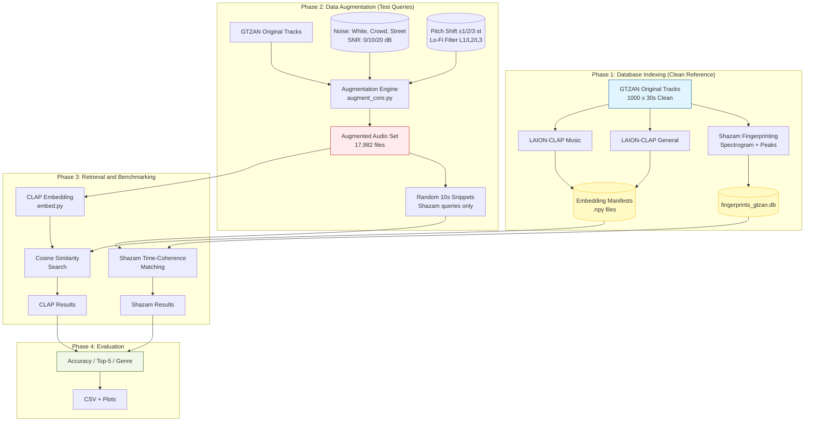

# Evaluating Shazam-Style Fingerprinting and Audio Embedding Retrieval Under Challenging Audio Conditions

This project investigates the robustness of two fundamentally different audio retrieval methodologies: **Deterministic Fingerprinting** (Shazam-style) and **Neural Audio Embeddings** (LAION-CLAP).

---

## Idea and Goals

The core objective is to evaluate how retrieval methods perform when subjected to real-world audio degradations — background noise, pitch distortion, and spectral filtering.

While Shazam's landmark-based hashing was once the gold standard for music identification, modern deep learning models offer semantic embeddings that capture higher-level musical features. However, most embedding models are trained on clean datasets, whereas Shazam was specifically engineered to survive the "noisy bar" scenario. This repository implements both approaches and benchmarks them against a common dataset under various stress conditions to determine their respective breaking points and failure modes.

## Data Description

The project uses the **GTZAN Dataset** — 1,000 audio tracks (10 genres, 100 files each, 30 seconds each).

To simulate real-world conditions, an augmented dataset (17,982 files) was generated across two degradation categories:

**Additive Noise (8,991 files)** — original tracks mixed with three noise types at three SNR levels:
- Noise types: White Noise, Crowd Noise, Street Noise
- SNR levels: 0 dB (equal power), 10 dB (café environment), 20 dB (quiet room)

**Musical Transforms (8,991 files)** — signal-level distortions without additive noise:
- Pitch Shift: ±1, ±2, ±3 semitones (up and down evaluated separately)
- Lo-Fi Bandpass Filter: three severity levels progressively narrowing the audible frequency range — Level 1 (300–8000 Hz), Level 2 (400–6000 Hz), Level 3 (500–4000 Hz)

## Code Structure

```
Data Augmentation/
  augment_core.py        # Core engine: AugSource, run_augmentation
  augment.py             # CLI: --aug white|pitch_up|pitch_down|lofi|file:<name>:<path>
  augment_gui.py         # Tkinter GUI for running augmentation

Models/
  embed.py               # Single CLAP embedding script (--music-model flag for specialist ckpt)

Shazam/
  src/                   # DSP pipeline: spectrogram, peak finding, time-coherence matching
  evaluation/
    build_gtzan_db.py    # Index full GTZAN tracks into fingerprints_gtzan.db
    evaluate_shazam.py   # Benchmark against augmented dataset (resume-safe CSV output)
    results/plots/       # Pre-generated Shazam result plots

Embedding Evaluations/
  eval_utils.py                      # Shared utilities for both evaluation scripts
  evaluate_gtzan_retrieval.py        # Genre classification (train on clean, test on augmented)
  evaluate_gtzan_exact_retrieval.py  # Exact-song retrieval (cosine similarity search)
  summarize_gtzan_data.py            # Dataset overview plots
  results/
    genre_classification/            # Pre-generated CLAP genre classification plots
    exact_song_retrieval/            # Pre-generated CLAP retrieval plots
    data_overview/                   # Dataset summary plots

evaluate.py              # Convenience dispatcher: python evaluate.py <summary|genre|retrieval>
analysis.ipynb           # Unified results notebook with discussion (renders on GitHub)
notes.md                 # Technical notes on evaluation design and key findings
requirements.txt         # All dependencies
```

## Key Findings

**Shazam**: ~91% on additive noise at all SNR levels. Drops to 0% on pitch-shift and 6–8% on lo-fi — the bandpass removes the high-frequency peaks the hashes depend on; pitch shifting destroys the exact frequency-time coordinates entirely.

**CLAP General**: Degrades gracefully. Exact retrieval: 61–77% Top-1 at 20 dB SNR, 22–33% on pitch shift, 28–60% on lo-fi. Genre classification: 86–92% at 20 dB SNR, 52–62% on pitch shift, 64–80% on lo-fi. The only system with non-zero pitch-shift robustness.

**CLAP Music**: Collapses on transforms. Exact retrieval ~0%, genre ~10% (random chance). Cosine similarity falls from ~0.99 on clean audio to ~0.048 on pitch-shifted audio. Fine-tuning on music increased sensitivity to exact tonal features, which is catastrophic when those features are altered.

**Headline**: Shazam and CLAP Music share the same fatal weakness — exact acoustic matching. CLAP General, a generalist model not designed for music retrieval, is the most transform-robust system. Broader training > specialist fine-tuning for robustness to musical transforms.

## System Architecture



## Getting Started

### Prerequisites

- Python 3.10+
- `librosa`, `scipy`, `numpy`, `soundfile` (DSP / augmentation)
- `laion_clap`, `torch`, `transformers` (embeddings)
- `scikit-learn`, `pandas`, `matplotlib` (evaluation)

### Installation

```bash
git clone https://github.com/barneypinkerton/Shazam-CLAP-Embedding-Analysis.git
cd Shazam-CLAP-Embedding-Analysis
pip install -r requirements.txt
```

### Data Augmentation

```bash
# CLI — generate all augmentation types
python "Data Augmentation/augment.py" \
  --input  /path/to/genres_original \
  --output /path/to/genres_augmented \
  --aug white --aug pitch_up --aug pitch_down --aug lofi \
  --aug file:crowd_noise:"Data Augmentation/crowd noise.wav" \
  --aug file:street_noise:"Data Augmentation/street noise.wav" \
  --levels 20 10 0

# GUI
python "Data Augmentation/augment_gui.py"
```

### CLAP Embedding

```bash
# General-purpose checkpoint
python Models/embed.py \
  --input  /path/to/Data \
  --output /path/to/Embeddings/CLAP_general \
  --checkpoint /path/to/630k-audioset-best.pt

# Music specialist checkpoint
python Models/embed.py \
  --input  /path/to/Data \
  --output /path/to/Embeddings/CLAP_music \
  --checkpoint /path/to/music_audioset_epoch_15_esc_90.14.pt \
  --music-model
```

### Shazam Evaluation

```bash
# Build the reference DB (one time)
python Shazam/evaluation/build_gtzan_db.py \
  --originals-root /path/to/genres_original

# Run the benchmark
python Shazam/evaluation/evaluate_shazam.py \
  --augmented-root /path/to/genres_augmented
```

### CLAP Embedding Evaluation

```bash
# Dataset overview
python "Embedding Evaluations/summarize_gtzan_data.py" \
  --data-root /path/to/Embeddings/CLAP_general

# Genre classification
python "Embedding Evaluations/evaluate_gtzan_retrieval.py" \
  --embedding-root /path/to/Embeddings/CLAP_general \
  --embedding-root /path/to/Embeddings/CLAP_music \
  --model-label "CLAP General" \
  --model-label "CLAP Music"

# Exact-song retrieval
python "Embedding Evaluations/evaluate_gtzan_exact_retrieval.py" \
  --embedding-root /path/to/Embeddings/CLAP_general \
  --embedding-root /path/to/Embeddings/CLAP_music \
  --model-label "CLAP General" \
  --model-label "CLAP Music"

# Add --write-csv to any evaluation script to also export summary tables
```

## References

- Wang, A. (2003). *An Industrial-Strength Audio Search Algorithm*. ISMIR.
- Elizalde, B., et al. (2023). *CLAP: Learning Audio Concepts From Natural Language Supervision*. ICASSP.
