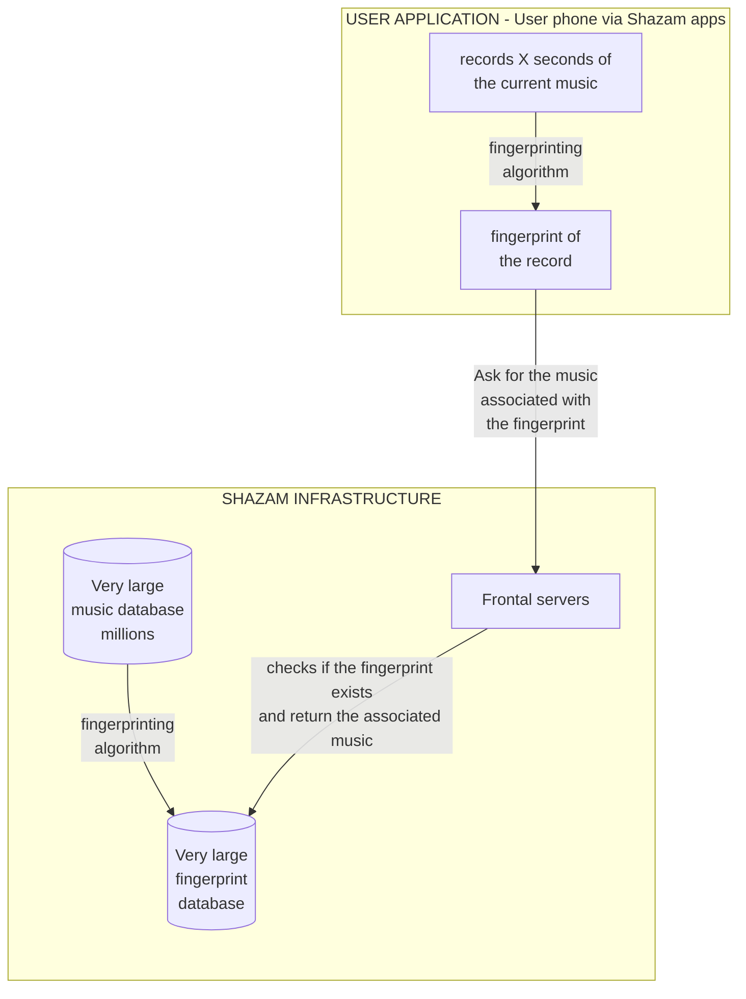

# Shazam
> A recreation of the Shazam music recognition algorithm.

## Overview
This project aims to recreate the core algorithm behind Shazam's audio acoustic recognition capabilities, utilizing audio fingerprinting and fast database lookups. 

## Technical Architecture

The following diagram maps out the data pipeline from registering tracks into the main database, to how user devices capture audio snippets and match them against the huge reference database.



## Features
- **Acoustic Fingerprinting:** Fast and scalable audio hashing mechanisms.
- **Audio Identification:** Real-time matching using time-coherence scoring across millions of fingerprints.
- **Microphone Support:** Shazam-style "Listen" mode with real-time volume visualization.
- **Large Dataset Support:** Optimized SQLite storage designed to handle massive libraries with high-speed B-Tree indexing.
- **Visual Diagnostics:** Full spectrograms and constellation peak overlays for every analyzed track.
- **Library Browser:** Browse your entire indexed collection and view real-time database statistics.

## How It Works

The core of the algorithm is based on creating robust identifiers for audio clips that can survive noise, distortion, and compression. Note that musical transforms such as pitch shifting alter the fundamental frequency-time coordinates that fingerprints depend on, and defeat the algorithm even at small magnitudes (e.g. ±1 semitone). Lo-fi bandpass filtering similarly removes the high-frequency peaks the hashes rely on.

1. **Ingestion & Spectrogram Generation:**
   Audio files act as raw inputs, which are mixed down to a neutral mono-signal. Background interference is purged via a tight 20Hz-5kHz mathematical bandpass filter, before safely decimating the sample stream down to an optimized 11,025Hz. An overlapping segmented frame pass computes a localized Hamming-Windowed Fast Fourier Transform (FFT) turning the waveform into a dense 2D magnitude spectrogram array.

2. **Constellation Map Extraction (Peak Finding):**
   To parse the dense spectrogram, the algorithm slices the vertical frequency axis into 6 specific logarithmic bins (mimicking human hearing prioritization):
   * *Very Low* `[0-10]`
   * *Low* `[10-20]`
   * *Low-Mid* `[20-40]`
   * *Mid* `[40-80]`
   * *Mid-High* `[80-160]`
   * *High* `[160-511]`
      The algorithm hunts across every timeframe, finding the single loudest peak frequency exclusively within each of these 6 segregated sub-bands. A global mean threshold filters against background fuzz by averaging these localized acoustic power events across the entire track. Finally, any data points breaching this threshold survive as confirmed targets, reducing millions of data points into a hyper-sparse, robust coordinate map known as a "Constellation Map".


*Visualizing the high-intensity peaks (dots) across the frequency spectrum over time.*

3. **Target Zones & Hashing:**
   These scattered constellation peaks are grouped into localized structural pairings (target zones) mapping time displacements between robust fundamentals to create highly unique collision-resistant integer hashes that fundamentally define the structural identity of the audio independent of ambient room distortions.

4. **Database Generation (Infrastructure):**
   A massive catalog of original music is processed by the fingerprinting algorithm. The result is stored in a highly optimized SQLite database containing millions of hashes mapped to their associated songs and relative timestamps (using B-Tree indexing for O(log N) lookup).

5. **User Query (Application):**
   When a user wants to identify a song, the application records a 10-second audio sample via the browser's `MediaRecorder` API or processes an uploaded file. This sample undergoes the exact same fingerprinting algorithm to produce a set of query hashes.

6. **Matching & Retrieval (Time Coherence Scoring):**
   These query hashes are sent to the backend, which looks them up in the fingerprint database. The engine performs **Time Coherence Scoring**: it calculates the time-offset between every matched hash in the snippet vs the original track. By finding the most frequent offset (the "mode"), the algorithm can identify the song even if the sample starts halfway through, with high certainty despite background noise.

### Implementation Details (Current Defaults)

The following details reflect the current code defaults in this repository.

1. **Peak selection per frame/band**
   For every time frame `t`, and for each of the 6 frequency bands, the algorithm picks exactly one local maximum (`np.max` + `np.argmax`) as a candidate peak.
   - This means: at most **1 candidate per band per frame**
   - With 6 bands: at most **6 candidates per frame** before thresholding
   - After thresholding, each candidate can be removed, so final peaks can be fewer

2. **Frame duration and hop duration**
   The pipeline currently uses:
   - `sample_rate = 11025 Hz`
   - `frame_size = 1024`
   - `overlap = 50%` (hop size = `512`)

   Therefore:
   - FFT window duration = `1024 / 11025 ~= 0.0929 s` (**92.9 ms**)
   - Frame-to-frame hop = `512 / 11025 ~= 0.0464 s` (**46.4 ms**)

   So in this implementation, a "time frame step" is ~46.4 ms (not 25 ms).

3. **Target zone constraints used during hashing**
   During anchor-target pairing, defaults are:
   - `target_zone_time = 50` frames (horizontal/time limit)
   - `target_zone_freq = 80` bins (vertical/frequency limit)
   - `max_targets_per_anchor = 5`

   Interpreting these limits:
   - Max time separation: `50 * 46.4 ms ~= 2.32 s`
   - Frequency resolution: `11025 / 1024 ~= 10.77 Hz/bin`
   - Max frequency-bin separation: `80 * 10.77 ~= 861 Hz` (approx.)

4. **Time-coherence voting (detailed)**
   After generating snippet hashes, each snippet hash is looked up in the DB.
   For every hash match:
   - DB provides `(song_id, db_offset, hash)`
   - Snippet has one or more `snippet_offset` values for that same hash
   - Compute `diff = db_offset - snippet_offset`
   - Increment vote count for `(song_id, diff)`

   Why this works:
   - For the correct song, many matched hashes preserve the same relative shift in time, so they produce nearly the same `diff`.
   - Those votes accumulate in one dominant `(song_id, diff)` bucket.
   - Incorrect songs produce scattered diffs and weaker buckets.
   - Final ranking uses each song's strongest diff bucket; top score wins.

   Example intuition:
   If the snippet begins about 200 frames later than the song's reference timeline, many correct matches cluster around `diff ~= 200`. That concentrated cluster is the match signal.

## Usage
### 1) Install dependencies
```bash
```

### 2) Run the web app
```bash
python3 app.py
```

Open: `http://127.0.0.1:8000`

### Optional: tune identification thresholds with `.env`
```bash
cp .env.example .env
```

Edit `.env` values to control how strict "match vs no match" behavior is, then restart the app.

### 3) Navigation Modes
The web UI provides three distinct modes:
*   **Analyze (Default):** Upload full-length tracks to generate and visualize fingerprints.
*   **Identify:** Identify a song by recording a 10-second snippet (Microphone) or uploading a short audio file.
*   **Library:** Browse your indexed collection, search by track name, and view database stats (Total Songs, Hashes, and DB size).

### 4) Add Songs To The Fingerprint Database

#### Add a single song
Use this when you want to index one specific file without scanning an entire folder.

```bash
python3 - <<'PY'
import os
from src.database import Database
from src.audioprocessing import process_audio_pipeline, load_audio
from src.fingerprinting import extract_peaks
from src.hashing import hashingAlgorithm

filepath = "/absolute/path/to/song.mp3"
db = Database("fingerprints.db")

if db.is_song_indexed(filepath):
    print("Already indexed:", filepath)
else:
    frame_size = 1024
    spec, _ = process_audio_pipeline(filepath, frame_size=frame_size)
    peaks = extract_peaks(spec, coefficient=1.0)
    fingerprints = hashingAlgorithm(
        peaks,
        target_zone_time=50,
        target_zone_freq=80,
        max_targets_per_anchor=5,
        include_metadata=False
    )
    sr, audio_data = load_audio(filepath)
    duration = len(audio_data) / sr
    song_id = db.add_song(os.path.basename(filepath), filepath, duration)
    db.add_fingerprints(song_id, fingerprints)
    print(f"Indexed song_id={song_id}, peaks={len(peaks)}, fingerprints={len(fingerprints)}")
PY
```

#### Add an entire folder
```bash
python3 - <<'PY'
from src.index_directory import index_folder
index_folder("/absolute/path/to/your/music/folder", db_path="fingerprints.db")
PY
```

### 5) Run the CLI pipeline directly (optional)

Run against a file:

```bash
export PYTHONPATH=$PYTHONPATH:.
python3 src/audioprocessing.py "/path/to/your/audio_file.wav"
```

If no arguments are provided, a built-in dummy signal test is generated:

```bash
python3 src/audioprocessing.py
```

The CLI output plot is written to: `/tmp/spectrogram_test.png`
